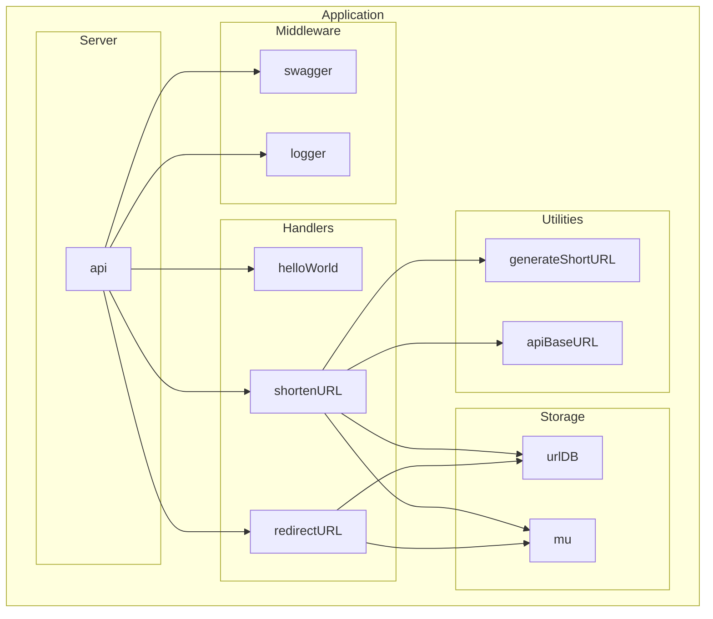

# URL Shortener API

A fast and efficient URL Shortener API that lets you shorten long URLs and easily redirect to the original ones. Built with the high-performance Fiber framework in Go, optimized for speed and minimal resource usage. 🚀

## API endpoints

- **GET /hello-world**: Test endpoint that returns a **"Hello World"** message. 👋
- **POST /shorten-url**: Shorten a long URL. ✂️
- **GET /{shortURL}**: Redirect to the original URL using the short URL code. 🔄

## Swagger documentation

You can interact with the API through the [Swagger UI](https://url-shortener-k9wx.onrender.com/docs).

## Mermaid diagram



## Running locally

1. Clone the repository:
    ```bash
    git clone https://github.com/mateuseap/url-shortener.git
    cd url-shortener
    ```

2. Install dependencies and run the API:
    ```bash
    go run .
    ```

3. The API will be available at `http://localhost:8080`.
